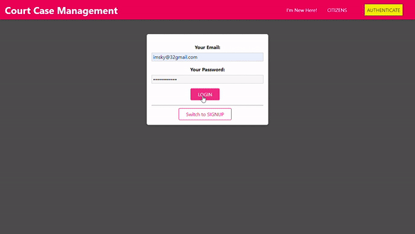

# Court Case Management

It is a MERN STACK-based web application that provides a common platform for citizens and court admin to manage created accounts, registered cases and update case status with every hearing.

Citizens can easily login, signup and register new cases online and then keep track of number of cases and status updates from court admin. In case plaintiff wants to delete the case they can do so.

Court administration can easily update case status, date of next hearing using admin loginID. 

All features of the app are available on navigation bar in desktop mode and in a sidemenu drawer in mobile view mode.

## Roadmap - Citizen

- Signup to create your account

- Go to new cases tab to register new cases via a form, when filled click ADD CASE and no. of cases by you will increase on home page.

- Click your icon on front page to see your registered cases enlisted. New cases will have default status and next hearing data untill updated by admin.

## Roadmap - Admin 
- Login by email: admin@admin.com & password: adminadmin.
- see cases registered by all the citizens and also get to update status for registered cases.
- can also delete existing cases.

## Demo

## New user Guide
- Login with user Aakash by EMAIL:imsky@32gmail.com and PASSWORD: jkljkljkljkl. or Go to Authenticate page to Signup a new account for yourself.
- One you click SIGNUP , you will be redirected to front page with your ID next to existing citizens ID.
### To see ADMIN Preview :
- Login with email: admin@admin and Password: adminadmin.
- Admin citizen card will not be displayed. 
- You can view cases description, status, edit status and delete existing cases from app frontend for any citizen.
### Register New Case:
- Go to NEW CASE page from navigation bar and fill form for registering new case. 
- Once done click ADD CASE Button and your case will be displayed under MY CASES tab.

 
## Features
### Responsive layout by viewport size.
- Sidemenu drawer for mobile viewport. Navigation bar for desktop.
### UI Element
- Modals as portals for case description, and delete warning. To show errors.
- Card component for Case , forms and citizens. Error modals ans loading spinner for loading display.
### Custom Form Elements
- useForm custom hook for input validation and overall form validation.
- Input and button as custom components with all extended features of validation check and event handling.
### Custom React hooks
- useForm() hook for form input validation and overall form validation based on unique validators and element id.
#### useHttpProcess() hook 
- to make HTTP requests to backend using fetch method. 
- To process recieved response, return errors, loading state of page and method to remove error modal from screen. 
- Abort Control of active http requests if user switches page in middle of a request.

## Tech Stack

**Client:** ReactJS

**Server:** MongoDB, Node, Express

## Authors

- [Aakash Mishra](https://sky-portfolio1.netlify.app/)

## About Me
I'm a computer science graduate and a beginner full MERN-stack developer.

